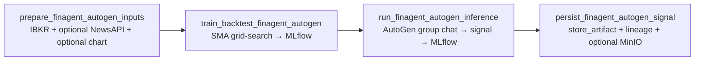

# FinAgent AutoGen Pipeline Workflow (`finagent_autogen_pipeline_workflow`)

This guide documents the AutoGen-orchestrated FinAgent pipeline DAG that supports:
- **Inference** (AutoGen multi-agent conversation → BUY/SELL/HOLD signal)
- **Train/Backtest** (offline SMA crossover grid-search → metrics + artifacts)
- **Both** (train/backtest then inference in a single DAG run)

The DAG logs an auditable trace to **MLflow** (conversation, signal JSON, metrics) and persists **WebUI artifacts** (signal + reasoning + optional chart) with lineage to the MLflow run.

---

## 1. Where the workflow lives

- DAG: `dags/finagent_autogen_pipeline_workflow.py`
- AutoGen orchestrator: `dags/utils/autogen_finagent_orchestrator.py`
- Backtest helpers: `dags/utils/finagent_autogen_backtest.py`
- MLflow utilities: `dags/utils/mlflow_tracking.py`
- Artifact persistence: `dags/utils/artifact_storage.py`
- Chart generation: `dags/utils/chart_generator.py`

---

## 2. Airflow task graph



Mode behavior:
- `mode=inference`: task **B** becomes a no-op (logs “skipping train/backtest”).
- `mode=train_backtest`: task **C** and **D** become no-ops.
- `mode=both`: all tasks execute.

---

## 3. Configuration

### 3.1 `.env` variables

Required for live inference:
- `OPENAI_API_KEY` (or `LLM_API_KEY`)

Recommended:
- `MLFLOW_TRACKING_URI` (defaults to `http://mlflow-server:5500` in docker compose)
- `NEWS_API_KEY` (optional; enables NewsAPI inputs)

New DAG settings (see `env.example`):
- `FINAGENT_AUTOGEN_ENABLED`
- `FINAGENT_AUTOGEN_DEFAULT_MODE` (`inference` | `train_backtest` | `both`)
- `FINAGENT_AUTOGEN_MAX_ROUNDS`
- `FINAGENT_AUTOGEN_BACKTEST_LOOKBACK_DAYS`

### 3.2 Airflow dependencies

The Airflow image must include:
- `autogen-core`
- `autogen-agentchat`
- `autogen-ext[openai]`

These are added to `airflow/requirements-airflow.txt`.

---

## 4. How to run

### 4.1 Trigger with Airflow UI

1. Start the docker stack.
2. Open Airflow UI and locate `finagent_autogen_pipeline_workflow`.
3. Trigger the DAG and set `dag_run.conf` (optional).

### 4.2 Example `dag_run.conf`

Inference only (default):
```json
{"mode": "inference"}
```

Train/backtest only:
```json
{"mode": "train_backtest", "backtest_lookback_days": 365}
```

Both:
```json
{"mode": "both", "backtest_lookback_days": 365}
```

---

## 5. What to expect in MLflow

Train/backtest run artifacts:
- `finagent_autogen_best_params.json`
- `finagent_autogen_grid_results.json`
- `finagent_autogen_equity_curve.json`

Inference run artifacts:
- `finagent_autogen_signal.json`
- `finagent_autogen_conversation.json`
- `finagent_autogen_agent_outputs.json`
- optional chart under `charts/`

---

## 6. What to expect in the WebUI

The persistence task stores:
- a **signal** artifact (BUY/SELL/HOLD + confidence)
- an **llm** artifact (final synthesized reasoning)
- an optional **chart** artifact (chart path + optional MinIO URL)

Lineage is attached via `run_id` / `experiment_id`.

