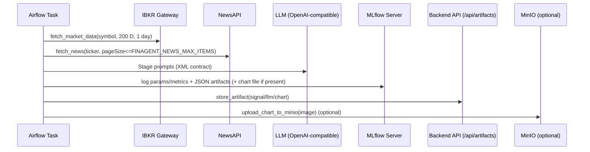
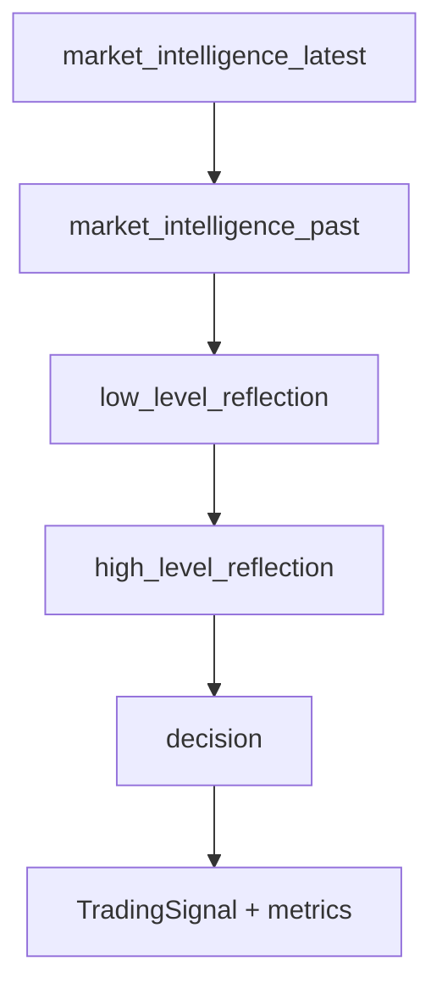
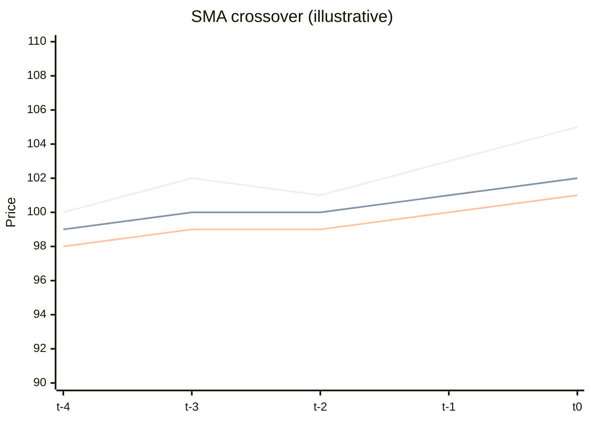

# FinAgent Paper v3 Workflow (`finagent_paper_v3_workflow`)

This document is a comprehensive, implementation-first guide to the **FinAgent paper v3** trading workflow implemented in this repo.

It covers:
- What the DAG does end-to-end (IBKR → NewsAPI → LLM stages → MLflow → artifacts)
- How the **v3 prompt pipeline** is assembled and parsed (XML contract)
- What signals/metrics are produced and how confidence/risk numbers are derived
- Practical runbooks: configuration, observability, failure modes, and debugging
- Indicator + decision **math theory** and the baseline heuristics used in code

If you only need to boot the stack, start with `docs/guides/FINAGENT_SETUP.md`.

> Note: This workflow is for research/automation. It is not financial advice.

---

## 0. Where the workflow lives (source map)

- DAG: `dags/finagent_paper_v3_workflow.py`
- Runner (orchestration + indicators + decision logic): `dags/utils/finagent_runner.py`
- Paper-v3 prompt templates (Appendix F, plain-text): `dags/utils/finagent_prompts_v3.py`
- XML parsing + sanitization: `dags/utils/finagent_xml.py`
- Market intelligence source (NewsAPI): `dags/utils/news_api_client.py`
- IBKR market data source: `dags/utils/ibkr_client.py`
- MLflow tracking: `dags/utils/mlflow_tracking.py`
- Artifact persistence (Web UI + DB API): `dags/utils/artifact_storage.py`
- Chart rendering (optional) + MinIO upload: `webapp/services/chart_service.py`, `dags/utils/minio_upload.py`
- Signal schema: `dags/models/signal.py`

### 0.1 Scheduling

This DAG is scheduled to run **every 10 minutes** by default (`*/10 * * * *`). To change the cadence, set `WORKFLOW_SCHEDULE` (cron or presets like `@hourly`) and restart Airflow so the DAG is reloaded.

---

## 1. High-level architecture

### 1.1 Airflow task graph

```mermaid
flowchart LR
  A[prepare_finagent_v3_inputs<br/>IBKR + NewsAPI] --> B[run_finagent_v3_agent<br/>FinAgentRunner (v3)]
  B --> C[log_finagent_v3_results<br/>MLflow params/metrics/artifacts]
  C --> D[persist_finagent_v3_signal<br/>Artifacts + lineage + optional MinIO]
```

### 1.2 End-to-end sequence (what talks to what)



---

## 2. What the DAG does (step-by-step)

### 2.1 `prepare_finagent_v3_inputs`

Purpose: build the “observation” used by FinAgent.

Inputs:
- `SYMBOL` from `STOCK_SYMBOLS` (first symbol) with a fallback (`TSLA`)
- IBKR host/port (DAG-level overrides) via `FINAGENT_IBKR_HOST` / `FINAGENT_IBKR_PORT`
- NewsAPI (optional) via `NEWS_API_KEY`

Outputs (XCom):
- `market_data`: serialized `MarketData` JSON
- `news_items`: JSON list of news records

Key snippet (trimmed):

```python
client = IBKRClient(host=IBKR_HOST, port=IBKR_PORT)
market_data = client.fetch_market_data(symbol=SYMBOL, duration="200 D", bar_size="1 day")
news_items = NewsAPIClient().fetch_news(ticker=SYMBOL, max_items=max_news)
ti.xcom_push(key="market_data", value=market_data.model_dump_json())
ti.xcom_push(key="news_items", value=json.dumps(news_items))
```

### 2.2 `run_finagent_v3_agent`

Purpose: execute the FinAgent v3 reasoning pipeline and produce:
- a normalized `TradingSignal`
- metrics (expected return proxy + confidence)
- a full “audit artifact” including prompts, raw responses, and parsed XML

Runner invocation (trimmed):

```python
runner = FinAgentRunner(prompts_version="v3")
result = runner.run(
  market_data=market_data,
  execution_id=str(context["run_id"]),
  dag_id=context["dag"].dag_id,
  task_id=context["task"].task_id,
  workflow_id=context["dag"].dag_id,
  news_items=news_items,
)
```

Inside `FinAgentRunner.run(...)`, stages execute in this order:



Each stage produces:
- `prompt` (rendered from v3 templates)
- `raw` model response (XML expected)
- `parsed` dict (from XML)

### 2.3 `log_finagent_v3_results`

Purpose: create an MLflow run and log a reproducible trace.

What is logged:
- Parameters: symbol, prompt version, model/provider, toolkit settings, NewsAPI enabled, etc.
- Metrics: `finagent_expected_return`, `baseline_expected_return`, `confidence_score`
- Artifacts:
  - `finagent_v3_llm_artifact.json` (prompts + raw responses + parsed XML)
  - `finagent_v3_market_snapshot.json` (recent OHLCV snapshot)
  - optional chart image under `charts/`

### 2.4 `persist_finagent_v3_signal`

Purpose: persist artifacts for the Web UI and lineage.

Stored artifacts (via `BACKEND_API_URL` → `/api/artifacts/`):
- `signal` artifact (BUY/SELL/HOLD + risk numbers + reasoning)
- `llm` artifact (prompt + response, plus reflection metadata)
- optional `chart` artifact (local image path and optional MinIO URL)

Lineage:
- `attach_artifact_lineage([...], mlflow_run_id, experiment_id)` patches artifacts with MLflow identifiers.

---

## 3. Output contracts (schemas you can rely on)

### 3.1 XML contract (LLM output)

The v3 prompts require the model to return XML like:

```xml
<output>
  <string name="analysis">...</string>
  <string name="action">BUY</string>
  <string name="reasoning">...</string>
</output>
```

Source of truth for the decision stage format: `dags/utils/finagent_prompts_v3.py`.

Parsing notes:
- XML is extracted from the first `<output ...>` to the last `</output>`.
- If the model emits invalid XML (common cause: unescaped `<` / `&`), parsing falls back to a best-effort sanitizer in `dags/utils/finagent_xml.py`.

### 3.2 Trading signal schema

The final payload includes a `TradingSignal` (Pydantic) from `dags/models/signal.py`. Key fields:
- `symbol`, `action` (`BUY|SELL|HOLD`), `confidence` (`HIGH|MEDIUM|LOW`), `confidence_score` (0–100)
- `reasoning` + `key_factors`
- Risk numbers: `suggested_entry_price`, `suggested_stop_loss`, `suggested_take_profit`, `r_multiple`, `position_size_percent`
- Metadata: `timeframe_analyzed="daily"`, `model_used=<LLM_MODEL>`

### 3.3 Example `finagent_result` payload shape

`run_finagent_v3_agent` pushes a single JSON blob to XCom (`key="finagent_result"`). Shape (fields may be omitted when optional):

```json
{
  "signal": {
    "symbol": "TSLA",
    "action": "HOLD",
    "confidence": "MEDIUM",
    "confidence_score": 50.0,
    "reasoning": "…",
    "key_factors": ["SMA20 <= SMA50", "RSI 48.2", "Volatility 0.0213"],
    "suggested_entry_price": 245.12,
    "suggested_stop_loss": 250.02,
    "suggested_take_profit": 235.32,
    "r_multiple": 1.7,
    "position_size_percent": 2.5,
    "timeframe_analyzed": "daily",
    "model_used": "gpt-4o",
    "generated_at": "2025-12-24T10:58:45.123Z"
  },
  "chart_path": "/tmp/.../TSLA_finagent.jpeg",
  "metrics": {
    "finagent_expected_return": 0.01,
    "baseline_expected_return": -0.002,
    "confidence_score": 50.0
  },
  "llm_artifact": {
    "prompt": "…decision prompt…",
    "response": "…decision reasoning…",
    "raw_response": "<output>…</output>",
    "reflections": { "low_level": {}, "high_level": {} },
    "baseline": { "ppo_action": "HOLD", "ppo_expected_return": 0.0 },
    "stages": { "market_intelligence_latest": {}, "decision": {} }
  },
  "market_snapshot": { "symbol": "TSLA", "bars": [] },
  "news": [],
  "baseline": { "ppo_action": "HOLD", "ppo_expected_return": 0.0 },
  "analysis_method": "finagent_v3",
  "prompt_version": "v3"
}
```

---

## 4. Charts (what they are and how they’re produced)

### 4.1 Technical chart generation (optional)

`FinAgentRunner` attempts to render a technical chart image:
- input: OHLCV dataframe (last ~200 daily bars by default)
- output: `*.jpeg` saved to a temp directory and referenced as `chart_path`

If chart rendering isn’t available, the run continues (you will see a warning):
- `Chart service unavailable; skipping Plotly export`

### 4.2 “Charts in docs” (Mermaid example)

This is an illustrative SMA crossover chart using Mermaid’s experimental xychart syntax (renderer support varies):



If your renderer does not support `xychart-beta`, here is the same data as a table:

| t   | Close | SMA20 | SMA50 |
|-----|------:|------:|------:|
| t-4 |   100 |    99 |    98 |
| t-3 |   102 |   100 |    99 |
| t-2 |   101 |   100 |    99 |
| t-1 |   103 |   101 |   100 |
| t0  |   105 |   102 |   101 |

---

## 5. Math theory (indicators + decision math used in code)

This section documents the actual math implemented in `dags/utils/finagent_runner.py` and the related “paper style” concepts.

### 5.1 Returns and volatility

Daily return:

$$
r_t = \frac{P_t - P_{t-1}}{P_{t-1}}
$$

Rolling volatility (code uses a 20-day rolling standard deviation of returns):

$$
\sigma_{20}(t) = \mathrm{std}\left(r_{t-19}, \dots, r_t\right)
$$

### 5.2 Simple moving averages (SMA)

For window length $n$:

$$
\mathrm{SMA}_n(t) = \frac{1}{n} \sum_{i=0}^{n-1} P_{t-i}
$$

Code uses:
- `SMA20` (short) and `SMA50` (long)
- A trend proxy: `bullish` if `SMA20 > SMA50`, `bearish` if `SMA20 < SMA50`

### 5.3 RSI (Relative Strength Index)

The implementation uses EMA-style smoothing (common RSI variant):
- Let $\Delta_t = P_t - P_{t-1}$
- $\mathrm{up}_t = \max(\Delta_t, 0)$
- $\mathrm{down}_t = \max(-\Delta_t, 0)$

Smoothed averages via EMA:

$$
\mathrm{RS}(t) = \frac{\mathrm{EMA}(\mathrm{up})(t)}{\mathrm{EMA}(\mathrm{down})(t)}
$$

$$
\mathrm{RSI}(t) = 100 - \frac{100}{1 + \mathrm{RS}(t)}
$$

### 5.4 MACD (strategy helper)

$$
\mathrm{MACD}(t) = \mathrm{EMA}_{12}(t) - \mathrm{EMA}_{26}(t)
$$

$$
\mathrm{Signal}(t) = \mathrm{EMA}_9(\mathrm{MACD})(t)
$$

The strategy helper emits a BUY if `MACD > Signal`, SELL if `MACD < Signal`.

### 5.5 KDJ / Stochastic-style strategy (with RSI filter)

Over a rolling window $n$ (code uses $n=9$):

$$
\mathrm{RSV}(t) = \frac{P_t - \min(L_{t-n+1}, \dots, L_t)}{\max(H_{t-n+1}, \dots, H_t) - \min(L_{t-n+1}, \dots, L_t)} \cdot 100
$$

K and D are EMA-like smoothings; J is derived:

$$
J(t) = 3K(t) - 2D(t)
$$

The helper uses RSI as an additional filter (e.g., BUY when K is low and RSI is low).

### 5.6 Mean reversion via z-score (strategy helper)

Rolling mean and std (code uses a 20-day window):

$$
\mu_{20}(t) = \mathrm{mean}(P_{t-19}, \dots, P_t), \quad s_{20}(t) = \mathrm{std}(P_{t-19}, \dots, P_t)
$$

Z-score:

$$
z(t) = \frac{P_t - \mu_{20}(t)}{s_{20}(t)}
$$

The helper suggests BUY if $z < -2$, SELL if $z > 2$.

### 5.7 Confidence scoring and “confirmations”

The code computes an integer confirmation count from four checks:
- `SMA20 > SMA50`
- `Close > SMA20`
- `RSI > 55`
- `Volatility < 0.03`

Confidence score:

$$
\text{confidence\_score} = \frac{\#\text{confirmations}}{4} \cdot 100
$$

Mapped to discrete levels:
- `HIGH` if score ≥ 80
- `MEDIUM` if 50 ≤ score < 80
- `LOW` if score < 50

### 5.8 Risk numbers (entry/stop/target and R-multiple)

For BUY:
- Entry is slightly below last close; stop is below; target is above (fixed percentages in code)

R-multiple:

$$
R = \frac{\text{target} - \text{entry}}{\text{entry} - \text{stop}}
$$

### 5.9 Baseline “RL” actions (heuristic proxy)

The “baseline” is a deliberately simple heuristic proxy (not a full RL implementation):
- action is BUY/SELL/HOLD based on SMA crossover
- expected return is approximated by relative distance from last close to SMA20:

$$
\text{baseline\_expected\_return} = \frac{\mathrm{SMA}_{20}}{P_t} - 1
$$

Returned under keys like `ppo_action`, `dqn_action`, `sac_action` to match paper-style naming.

---

## 6. Configuration reference (.env)

### 6.1 Required/commonly used

NewsAPI (optional but recommended):
- `NEWS_API_KEY` (enables real market intelligence fetch)
- `NEWS_API_BASE_URL` (default: `https://newsapi.org/v2/everything`)
- `NEWS_API_LANGUAGE`, `NEWS_API_SORT_BY`, `NEWS_API_PAGE_SIZE`, `NEWS_API_TIMEOUT`
- `FINAGENT_NEWS_MAX_ITEMS` (DAG-level cap; default `10`)

LLM (OpenAI-compatible):
- `LLM_PROVIDER=openai`
- `LLM_API_KEY`
- `LLM_API_BASE_URL` (supports OpenAI-compatible endpoints)
- `LLM_MODEL`, `LLM_VISION_MODEL`
- `FINAGENT_PROMPTS_VERSION=v3` (runner selects v3 templates when `prompts_version="v3"`)

MLflow:
- `MLFLOW_TRACKING_URI`
- `MLFLOW_EXPERIMENT_NAME`

Artifact persistence:
- `BACKEND_API_URL` (used by `store_artifact(...)`)

IBKR connectivity:
- `FINAGENT_IBKR_HOST`, `FINAGENT_IBKR_PORT` (DAG-level overrides)
- Also see `IBKR_HOST`, `IBKR_PORT` in `dags/utils/config.py` (used by other DAGs)

Weaviate vector memory (optional):
- `WEAVIATE_URL`, `WEAVIATE_API_KEY` (if unset, runner uses in-memory store)

---

## 7. Troubleshooting (common failures and what to do)

### 7.1 `Invalid FinAgent XML: mismatched tag`

Symptoms:
- Airflow task fails in `run_finagent_v3_agent` with an XML parse error.

Cause:
- The model returned invalid XML (often from unescaped `<` / `&` or stray tags inside text).

Mitigations in this repo:
- `parse_finagent_xml()` retries parsing after sanitizing invalid characters.

If it persists:
- Inspect the `raw_response` stored in `finagent_v3_llm_artifact.json` in MLflow.
- Consider tightening prompts, lowering temperature, or enforcing a stronger XML-only response policy at the provider layer.

### 7.2 Chart warnings

`Chart service unavailable; skipping Plotly export`
- The workflow continues without images. Ensure `webapp/services/chart_service.py` dependencies (e.g., Plotly/Kaleido) are available in the Airflow image if you want chart artifacts.

### 7.3 News is always empty

- If `NEWS_API_KEY` is not set, `NewsAPIClient` returns `[]` and the runner falls back to mock news items.
- Confirm `.env` is loaded by your docker stack and that Airflow has access to it.

### 7.4 No artifacts in the Web UI

- Ensure the backend is reachable from Airflow via `BACKEND_API_URL`.
- Check backend logs for `/api/artifacts/` errors (auth, schema, connectivity).

---

## 8. Extending the workflow

Common extensions:
- Multi-symbol runs: adapt the DAG to iterate over `config.stock_symbols` and persist per-symbol artifacts.
- Stronger baselines: replace `_compute_rl_baseline()` with a real backtest or a learned policy.
- Prompt evolution: keep `finagent_prompts_v3.py` as the “verbatim” source and add a new version file for controlled modifications.
