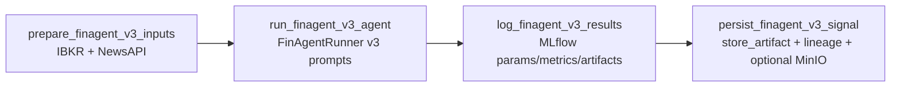

# FinAgent Paper v3 Workflow (`finagent_paper_v3_workflow`)

This guide documents the paper-faithful FinAgent trading DAG that:
- Uses arXiv:2402.18485v3 Appendix F prompt templates (`dags/utils/finagent_prompts_v3.py`)
- Fetches “latest market intelligence” via **NewsAPI** (configured via `.env`)
- Logs an auditable trail to **MLflow** (prompts, raw responses, parsed XML, metrics, charts)
- Persists signal + reasoning artifacts for the Web UI

If you only need to enable/boot the stack, start with `docs/guides/FINAGENT_SETUP.md`.

---

## 1. Where the workflow lives

- DAG: `dags/finagent_paper_v3_workflow.py`
- FinAgent runner: `dags/utils/finagent_runner.py` (uses `FinAgentRunner(prompts_version="v3")`)
- Paper-v3 prompts: `dags/utils/finagent_prompts_v3.py`
- NewsAPI client: `dags/utils/news_api_client.py`
- MLflow: `dags/utils/mlflow_tracking.py`
- Artifact storage + lineage: `dags/utils/artifact_storage.py`
- MinIO upload: `dags/utils/minio_upload.py`

---

## 2. Airflow task graph

### 2.1 `prepare_finagent_v3_inputs`

- Fetches OHLCV from IBKR via `IBKRClient.fetch_market_data(...)`
- Fetches recent news via `NewsAPIClient.fetch_news(...)`
- Stores XCom:
  - `market_data` (JSON)
  - `news_items` (JSON list)

### 2.2 `run_finagent_v3_agent`

- Runs the FinAgent stages:
  - latest market intelligence (LLM XML)
  - past market intelligence (retrieval + LLM XML)
  - low-level reflection (LLM XML + optional chart vision)
  - high-level reflection (LLM XML + optional chart vision)
  - decision-making (LLM XML)
- Returns a normalized payload with `analysis_method="finagent_v3"` and the full `llm_artifact` stage trace.

### 2.3 `log_finagent_v3_results`

Creates an MLflow run tagged with:
- `analysis_method=finagent_v3`
- `prompt_version=v3`
- `news_source=newsapi` (when configured)

Artifacts include:
- `finagent_v3_llm_artifact.json`
- `finagent_v3_market_snapshot.json`
- Optional chart image under `charts/`

### 2.4 `persist_finagent_v3_signal`

Stores up to three artifacts for the Web UI:
- signal (`artifact_type="signal"`)
- llm reasoning (`artifact_type="llm"`)
- optional chart (`artifact_type="chart"` + MinIO URL)

---

## 3. Configuration (.env)

Required for live news:
- `NEWS_API_KEY` (from `https://newsapi.org/`)

Recommended defaults:
- `NEWS_API_BASE_URL=https://newsapi.org/v2/everything`
- `NEWS_API_LANGUAGE=en`
- `NEWS_API_SORT_BY=publishedAt`
- `NEWS_API_PAGE_SIZE=10`
- `NEWS_API_TIMEOUT=10`

Optional:
- `FINAGENT_NEWS_MAX_ITEMS=10` (DAG-level cap)

---

## 4. How to run

1. Start the docker stack.
2. Ensure `.env` includes `NEWS_API_KEY` (optional but recommended).
3. In Airflow, trigger `finagent_paper_v3_workflow`.

