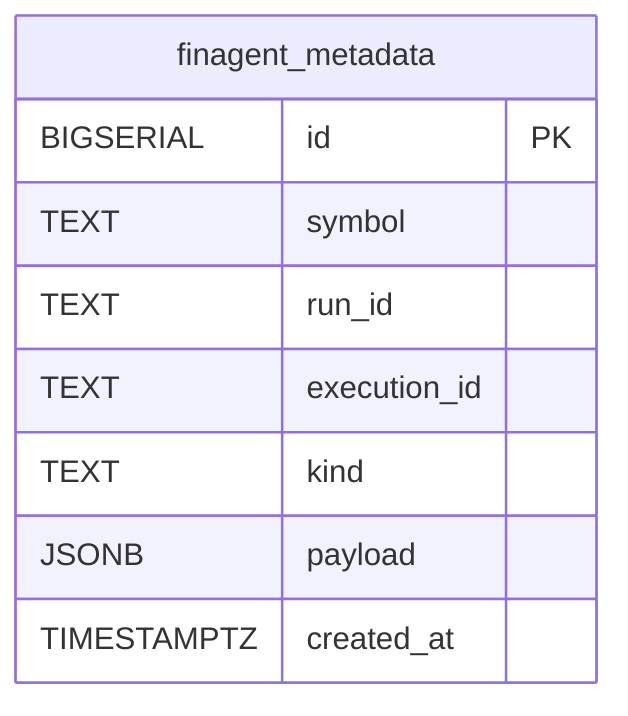

# FinAgent Trading Signal Workflow (`finagent_trading_signal_workflow`)

This guide documents the Airflow DAG that generates an end-to-end FinAgent-style trading signal using:
- **IBKR market data** (via `IBKRClient`)
- **FinAgent runner** stages (market intelligence → reflections → decision)
- **Artifacts + lineage** (stored for the WebUI)
- **MLflow** experiment tracking
- Optional **Neon Postgres** metadata snapshots
- Optional **Weaviate** diversified memory
- Optional **MinIO** chart uploads

If you only need to enable/boot the stack, start with `docs/guides/FINAGENT_SETUP.md`.

For the paper-faithful workflow that uses arXiv:2402.18485v3 Appendix F prompts and NewsAPI market intelligence, see `docs/guides/FINAGENT_PAPER_V3_WORKFLOW.md`.

---

## 1. Where the workflow lives

- DAG: `dags/finagent_trading_signal_workflow.py`
- FinAgent orchestration: `dags/utils/finagent_runner.py`
- Prompt templates: `dags/utils/finagent_prompts.py`
- XML parsing/validation: `dags/utils/finagent_xml.py`
- IBKR data: `dags/utils/ibkr_client.py`
- MLflow: `dags/utils/mlflow_tracking.py`
- Artifact storage + lineage: `dags/utils/artifact_storage.py`
- MinIO chart upload: `dags/utils/minio_upload.py`
- Optional Neon persistence: `dags/utils/metadata_store.py`

---

## 2. High-level flow (what it does)

At a high level the DAG:
1. Fetches historical OHLCV bars from IBKR for a single symbol.
2. Runs a FinAgent-style reasoning pipeline that can use:
   - chart image as a vision input (if chart export works)
   - “memory” from Weaviate or a local in-memory fallback
   - a small RL-style baseline (heuristic proxy)
3. Logs everything to MLflow (params, metrics, reasoning artifacts, optional chart).
4. Persists the signal, LLM reasoning, and chart references as “artifacts” so the Web UI can display them.

---

## 3. Workflow chart (Airflow tasks)

```mermaid
flowchart LR
  A[prepare_finagent_inputs<br/>IBKRClient.fetch_market_data()] --> B[run_finagent_agent<br/>FinAgentRunner.run()]
  B --> C[log_finagent_results<br/>MLflow run + artifacts]
  C --> D[persist_finagent_signal<br/>store_artifact + lineage + optional MinIO]

  subgraph XCom
    AX[(market_data JSON)]
    BX[(finagent_result JSON)]
    CX[(mlflow_info JSON)]
  end

  A -.push.-> AX
  B -.push.-> BX
  C -.push.-> CX
```

### 3.1 `prepare_finagent_inputs`

File: `dags/finagent_trading_signal_workflow.py`

Responsibilities:
- Connect to IBKR at `FINAGENT_IBKR_HOST:FINAGENT_IBKR_PORT`
- Fetch historical bars:
  - `duration="200 D"`
  - `bar_size="1 day"`
- Store inputs for downstream tasks in XCom:
  - `market_data` (JSON)
  - `symbol`

Notes:
- `IBKRClient` can operate in three modes:
  - `ib_insync` (preferred)
  - IBKR **Client Portal REST** (if configured)
  - **mock** fallback (if neither is configured and strict mode is off)

### 3.2 `run_finagent_agent`

File: `dags/finagent_trading_signal_workflow.py`

Responsibilities:
- Load `market_data` from XCom and validate as `MarketData`.
- Run `FinAgentRunner.run(...)` to produce:
  - `signal` (`TradingSignal`)
  - `metrics`
  - `llm_artifact` (prompts/responses + parsed XML + reflections)
  - `baseline` (heuristic RL proxy)
  - `market_snapshot` (trimmed OHLCV payload)
  - `chart_path` (optional local path to JPEG)
  - `news` (mock news list unless you pass in real items)

Stores a single XCom payload: `finagent_result` (JSON).

### 3.3 `log_finagent_results`

File: `dags/finagent_trading_signal_workflow.py`

Responsibilities:
- Create an MLflow run tagged as `workflow_type=finagent_signal`.
- Log params (symbol, LLM model/provider, toolkit, reflection rounds).
- Log metrics (`confidence_score`, expected returns).
- Log JSON artifacts:
  - `finagent_llm_artifact.json`
  - `finagent_market_snapshot.json`
- Log chart file (if present) under `charts/`.

Stores XCom:
- `mlflow_info` (JSON: `run_id`, `experiment_id`)
- `logged_result` (same as `finagent_result`, for convenience)

### 3.4 `persist_finagent_signal`

File: `dags/finagent_trading_signal_workflow.py`

Responsibilities:
- Convert the signal + reasoning into persistent “artifact” records used by the Web UI.
- Optionally upload the chart image to MinIO and attach the resulting URL.
- Attach lineage between created artifacts and the MLflow run/experiment.

Creates up to 3 artifacts via `store_artifact(...)`:
- **signal**: action + confidence + computed trade levels
- **llm**: prompt + response + reflection summaries
- **chart**: image path + optional `minio_url`

---

## 4. FinAgentRunner chart (internal reasoning pipeline)

```mermaid
flowchart TD
  MD[MarketData bars] --> DF[pandas DataFrame]
  DF --> CH{Chart service available?}
  CH -- yes --> JPG[Chart JPEG export]
  CH -- no --> NCH[No chart]

  DF --> SNAP[market_snapshot (last ~120 bars)]
  SNAP --> NEON1[(Neon finagent_metadata<br/>kind=market_data)]

  NEWS[news items<br/>(mock or provided)] --> NEON2[(Neon finagent_metadata<br/>kind=import_data)]

  JPG --> CTX[FinAgentContext<br/>SMA20/SMA50 + RSI + volatility]
  NCH --> CTX
  DF --> CTX
  NEWS --> CTX

  CTX --> BASE[Baseline (heuristic RL proxy)]

  CTX --> MI1[Market intelligence (latest)<br/>LLM XML]
  MI1 --> MEM1[(Weaviate or local memory)]
  MI1 --> NEONP1[(Neon finagent_metadata<br/>kind=llm_prompt stage=market_intelligence_latest)]

  MEM1 --> MI2[Market intelligence (past)<br/>retrieval + LLM XML]
  MI2 --> NEONP2[(Neon finagent_metadata<br/>kind=llm_prompt stage=market_intelligence_past)]

  MI1 --> LLR[Low-level reflection<br/>LLM XML + optional chart vision]
  MI2 --> LLR
  LLR --> MEM2[(memory: low_level_reflection_summary)]
  LLR --> NEONP3[(Neon finagent_metadata<br/>kind=llm_prompt stage=low_level_reflection)]

  MEM2 --> HLR[High-level reflection<br/>LLM XML + optional chart vision]
  HLR --> MEM3[(memory: high_level_reflection_summary)]
  HLR --> NEONP4[(Neon finagent_metadata<br/>kind=llm_prompt stage=high_level_reflection)]

  MEM2 --> DEC[Decision<br/>LLM XML]
  MEM3 --> DEC
  BASE --> DEC
  DEC --> NEONP5[(Neon finagent_metadata<br/>kind=llm_prompt stage=decision)]

  DEC --> SIG[TradingSignal<br/>BUY/SELL/HOLD + levels]
  SIG --> OUT[Return payload<br/>signal + metrics + artifacts]
```

### 4.1 Chart export behavior

`FinAgentRunner` uses `webapp.services.chart_service.generate_technical_chart(...)` to create a `*.jpeg` chart.

Common reasons charts may be missing:
- chart service import fails (logs “Chart service import fallback engaged”)
- Plotly/Kaleido export fails at runtime

In those cases:
- the workflow continues
- vision prompts will run **without** images
- MLflow will simply not log chart artifacts
- MinIO uploads will be skipped

---

## 5. Data model “chart” (Neon + Weaviate)

### 5.1 Neon Postgres: `finagent_metadata`

If `NEON_DATABASE` (or `DATABASE_URL`) is configured, `FinAgentMetadataStore` writes records to a single table.



Kinds written by the runner:
- `market_data` (snapshot of bars + metadata)
- `import_data` (news payload)
- `llm_prompt` (prompt/response, keyed by `payload.stage`)

### 5.2 Weaviate memory (optional)

If `WEAVIATE_URL` and `WEAVIATE_API_KEY` are configured and the `weaviate-client` dependency is present:
- a `FinAgentMemory` collection is created (if missing)
- short summaries are stored to support retrieval (past market intelligence + past reflections + past decisions)

If Weaviate is not configured/available:
- the runner uses an in-memory list (up to ~200 records) for the duration of the process.

---

## 6. Configuration (environment variables)

Core variables used directly by this workflow:

| Variable | Used by | Purpose |
|---|---|---|
| `STOCK_SYMBOLS` | `dags/utils/config.py` | The DAG picks the first symbol as `SYMBOL`. |
| `FINAGENT_IBKR_HOST` | `dags/finagent_trading_signal_workflow.py` | Host for IBKR market data. |
| `FINAGENT_IBKR_PORT` | `dags/finagent_trading_signal_workflow.py` | Port for IBKR market data (often `4002` paper). |
| `LLM_PROVIDER` / `OPENAI_API_KEY` / `OPENAI_API_BASE` / `LLM_MODEL` | `dags/utils/config.py` + `FinAgentLLMClient` | LLM used for XML prompt stages. |
| `LLM_VISION_MODEL` | `dags/utils/config.py` | Vision model name for image stages (low/high reflection). |
| `FINAGENT_REFLECTION_ROUNDS` | `dags/utils/config.py` | Controls how many reflection iterations FinAgentRunner attempts. |
| `FINAGENT_TOOLKIT` | `dags/utils/config.py` | Labels which tools are “enabled” (logged to MLflow). |
| `NEON_DATABASE` | `dags/utils/metadata_store.py` | Enables Postgres persistence for prompts/snapshots. |
| `WEAVIATE_URL` / `WEAVIATE_API_KEY` | `dags/utils/finagent_runner.py` | Enables diversified memory via Weaviate. |

Important behavior:
- If `OPENAI_API_KEY` is missing (or OpenAI SDK isn’t installed), `FinAgentLLMClient` runs in **mock mode** and returns deterministic placeholders so the pipeline can still execute.

---

## 7. How to run it (local)

### 7.1 Trigger manually in Airflow UI

1. Start the docker stack.
2. Open Airflow and locate the DAG `finagent_trading_signal_workflow`.
3. Trigger it manually.

### 7.2 Test the DAG from the Airflow container

From your environment where Airflow CLI is available:

```bash
airflow dags test finagent_trading_signal_workflow 2025-01-01
```

*(Use any date; this DAG has `schedule=None` and `catchup=False`.)*

---

## 8. What outputs to expect (and where)

After a successful run:
- **MLflow**:
  - run name: `finagent_<SYMBOL>_<timestamp>`
  - tags: `workflow_type=finagent_signal`, `analysis_method=finagent_v1`
  - artifacts: JSON + optional chart
- **Artifact store** (Web UI backing store):
  - signal artifact (`artifact_type=signal`)
  - llm artifact (`artifact_type=llm`)
  - chart artifact (`artifact_type=chart`, optional)
  - lineage links the above to the MLflow run
- **MinIO**:
  - optional chart object
  - URL is attached to the chart artifact metadata as `minio_url`
- **Neon** (optional):
  - `finagent_metadata` receives market snapshot + prompt/response archives
- **Weaviate** (optional):
  - memories for market intelligence, reflections, and decisions

---

## 9. Troubleshooting

### 9.1 “Charts missing” but workflow succeeds

This is expected if:
- `webapp.services.chart_service` cannot import, or
- chart export dependencies aren’t available.

Check logs for:
- `Chart service import fallback engaged`
- `Failed to render FinAgent chart via chart_service`

### 9.2 “LLM looks fake / generic”

The runner will operate in **mock mode** unless all of these are true:
- `LLM_PROVIDER=openai`
- `OPENAI_API_KEY` is set
- the OpenAI SDK is installed in the Airflow runtime image

### 9.3 Weaviate not used

You need:
- `WEAVIATE_URL` and `WEAVIATE_API_KEY`
- `weaviate-client` installed in the Airflow image

Otherwise it falls back to in-memory memory.
