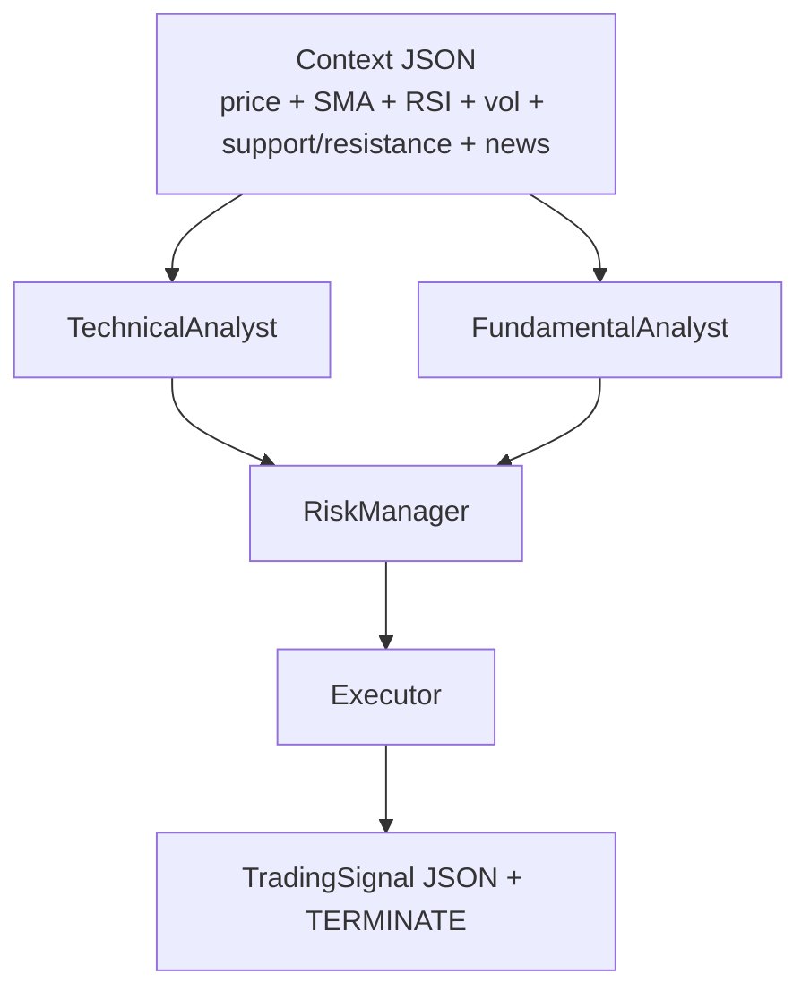
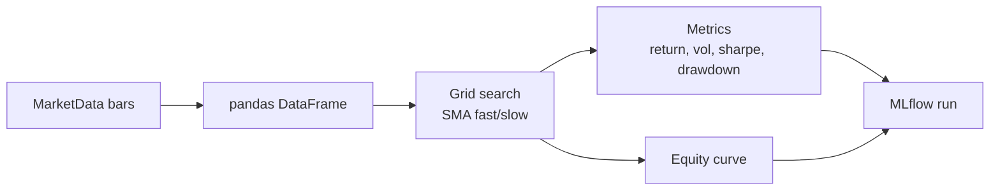
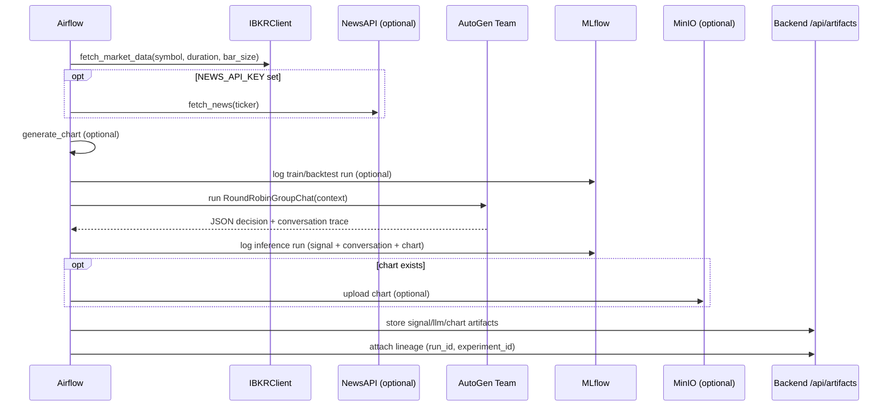

# FinAgent AutoGen Pipeline — Model Logic (Deep Dive)

This document describes the internal logic of the AutoGen-based FinAgent pipeline added by:
- `dags/finagent_autogen_pipeline_workflow.py`
- `dags/utils/autogen_finagent_orchestrator.py`
- `dags/utils/finagent_autogen_backtest.py`

The goal is **auditability** (full trace in MLflow), **repeatability** (deterministic offline backtest), and **WebUI compatibility** (artifacts persisted to the backend API).

---

## 1. High-level architecture

```mermaid
flowchart TB
  subgraph Airflow["Airflow (DAG: finagent_autogen_pipeline_workflow)"]
    A1[prepare_inputs] --> A2[train_backtest (optional)]
    A2 --> A3[inference (AutoGen)]
    A3 --> A4[persist artifacts]
  end

  subgraph Data["Inputs"]
    D1[IBKR OHLCV bars]
    D2[NewsAPI headlines (optional)]
    D3[Chart image (optional)]
  end

  subgraph Stores["Stores/Lineage"]
    S1[MLflow tracking + artifacts]
    S2[MinIO charts (optional)]
    S3[Backend DB via /api/artifacts]
  end

  D1 --> A1
  D2 --> A1
  D3 --> A1

  A2 --> S1
  A3 --> S1
  A4 --> S3
  A4 --> S2
  S1 --> A4
```

---

## 2. Inference logic (AutoGen agent conversation)

The inference stage turns a market snapshot into a single `TradingSignal` decision by running a constrained group chat:

- **TechnicalAnalyst**: interprets indicators and structure (trend, support/resistance).
- **FundamentalAnalyst**: summarizes news items (only what is provided).
- **RiskManager**: proposes conservative trade levels and sizing guidance.
- **Executor**: synthesizes the above into the final JSON decision.



Implementation notes:
- The orchestrator uses `RoundRobinGroupChat` with a termination condition that triggers only when the **Executor** emits `TERMINATE`.
- The Executor is required to output a **single JSON object** (parsed into `TradingSignal`) followed by `TERMINATE`.

Artifacts emitted to MLflow:
- `finagent_autogen_conversation.json` (all agent messages)
- `finagent_autogen_signal.json` (final normalized signal)
- `finagent_autogen_agent_outputs.json` (context + stop reason)

---

## 3. Train/Backtest logic (offline evaluation)

The “train_backtest” mode is intentionally deterministic and does not depend on repeated LLM calls.

Current implementation:
- A small grid-search over SMA crossover parameters
- Evaluation metrics logged to MLflow
- Best params logged as a “config package” artifact



Logged artifacts:
- `finagent_autogen_best_params.json`
- `finagent_autogen_grid_results.json`
- `finagent_autogen_equity_curve.json`

---

## 4. Sequence diagram (end-to-end)



---

## 5. Failure modes and fallbacks

- **Missing AutoGen deps**: inference raises a clear error instructing to install `autogen-agentchat` + `autogen-ext[openai]` in the Airflow image.
- **Chart generation fails**: inference continues without a chart; MLflow chart artifact and MinIO upload are skipped.
- **News fetch fails**: inference continues with empty news list.
- **Executor JSON parse fails**: inference fails fast (so it’s visible in Airflow/MLflow).

